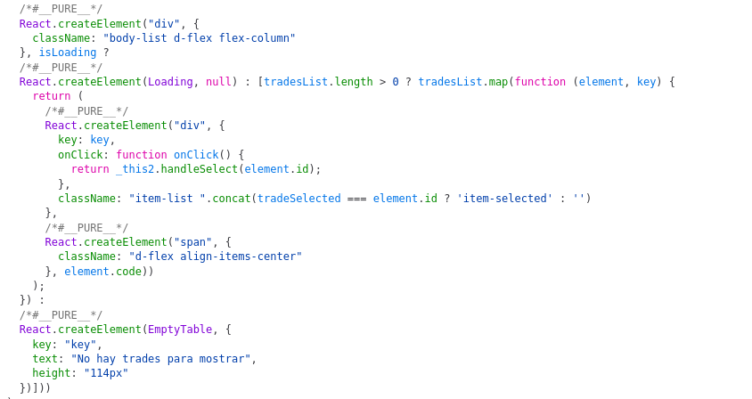
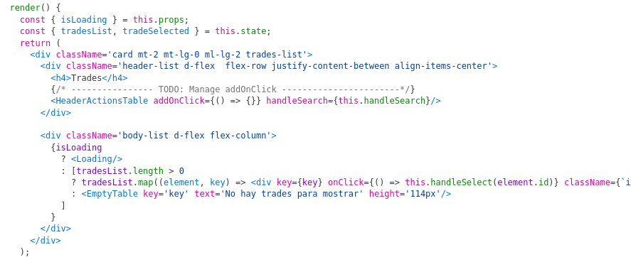

# Django 3 Project Template™

Django 3 Project Template™ provides a common starting point for Django projects, it provides known and tested approaches for the most common features found on Magnet projects.
This is the recommended way for starting a new project.

## Changes from the previous version
### Development containers
D3PT provides a consistent development experience between platforms by placing the Python environment in a reproducible Docker container that closely matches production.
No matter you're using a Mac, Windows or Linux host, the development environment will always be the same.

This change takes advantage of the VS Code development environments feature, and it has been tested on such.

### Django 3.2 LTS
This template is based on Django 3.2.x, which is supported up to 2024. Some introduced features are:
* Automatic AppConfig discovery
* Indexes now support expressions and DB functions
* Built-in enumeration types
* ASGI and asynchronous views support
* `pymemcache` support

### TypeScript and WebPack 5 support
[TODO]

## Getting started
### Get the code
Create a new repository for your django project and clone your repository into
your computer.

Add the django3-project-template bitbucket repo as a remote repository:
* `git remote add template git@bitbucket.org:magnet-cl/django3-project-template.git`

Pull the code from the project template:
* `git pull template main`

Search and replace all occurrences of `project-name-placeholder` to your desired project name

Configure `git_repo` in `ansible/group_vars/all.yaml`

Push to your own repo:
* `git push origin master`

Now you have your own django project in your repository.

Remove the `LICENSE` if your new project does not have an MIT license.

### Quickstart
The `quickstart.sh` script includes the following actions:

* Create a local .env file if not present.
* Install docker and docker-compose.
* Build and start the containers.
* Prompt to run django migrations.
* Prompt to create a superuser.
* Apply settings to use vscode devcontainers.

### Running the project

- Reboot your computer if quickstart prompted to do so (to run Docker without sudo)
- Open this folder in VSCode
- Click "Reopen in Container" when prompted (or press F1 and choose "Reopen in Container")

<details>
<summary>CLI alternative</summary>

> Instead of running:
> ```sh
> code .
> ```
> and having click to reopen in container every time, install this:
> ```sh
> npm install -g @devcontainers/cli
> ```
> and then in place of `code .` , use this:
> ```sh
> devcontainer open
> ```
</details>

Then in a VSCode terminal, run:
```sh
npm start
```
and in another terminal, run:
```sh
djs
```
and access the site at http://localhost:8000

#### "Without" VSCode

Note: commands written here with [oh-my-zsh aliases](https://github.com/ohmyzsh/ohmyzsh/blob/master/plugins/docker-compose/docker-compose.plugin.zsh).

In a terminal in this folder,
- Start the containers with `dcupd` (faster), or rebuilding with `dcupb -d` (slower but may be required)
- Spawn a container shell with `dce django zsh`
- If it printed _vscode env not loaded_, then you are missing [some features provided by VSCode](https://code.visualstudio.com/docs/remote/containers#_sharing-git-credentials-with-your-container) and may have problems using Git. To fix this:
  - Outside the container, run `devcontainer open` (see "CLI alternative" above)
  - Wait for VSCode and the container to load, and hide its window somewhere.
  - Now you may use `dce django zsh` to run django and node and git. And an alternative IDE to edit files. Unfortunately you have to keep the VSCode window open.
  - For how this works, see `90-vscode-env.zsh` in this repo.

#### Resetting to initial state

If you are used to work with docker-compose, you may try to reset your project to an initial state with `docker-compose down -v`. However we are not using volumes, just bind mounts. So use instead:
```sh
docker-compose down
rm -rf docker/volumes/
git restore docker/volumes/
```

#### Troubleshooting

##### Very strange errors occur when running `git commit`

Because there's a hook which uses pre-commit, lint-staged and other tools, if they are not properly installed then the commit will be prevented.

Examples of these errors are:

_Command not found: pre-commit_<br>
_SyntaxError: The requested module 'supports-color' does not provide an export named 'default'_

and they all end with:
```
husky - pre-commit hook exited with code 1 (error)
```
To fix this:

1. Ensure that if you have local changes to:
    - package.json
    - package-lock.json
    - pyproject.toml
    - poetry.lock

    then they are reasonable. (For example the version of lint-staged hasn't been changed by mistake)

2. Reinstall npm packages with `npm ci` and Poetry packages with `poetry install`

##### `zsh: command not found: dj`

If for some reason the virtualenv is deleted, `poetry install` won't recreate the `dj` symlink, it has to be manually created again with:
```sh
ln -s /usr/src/app/manage.py $(poetry env info --path)/bin/dj
```
Or just recreate the container (as the symlink is included in the image).

### Start a new django application
Use the custom app template to create your apps:

`python manage.py startapp --template=project/app_template {app_name} --model_name [model_name]`

The app template assumes your app name is a plural, the `model_name` parameter
is optional. The template contains the following:

 - A model that is named the same as your app, but in singular. The model name
   can be changed by passing the `model_name` parameter to the `startapp`
   command.
 - A `views.py` file with all CRUD views for the model.
 - A `urls.py` file mapping all CRUD views.
 - A `managers.py` file with a single QuerySet for the model
 - A `forms.py` file with a single Form for the model
 - An `admin.py` file with a single Admin for the model
 - A `templates` folder with templates in .pug format for all CRUD views.

### Changes to .env file while developing
If you change your .env file, you'll need to rebuild your container for the setting to take effect.
You can do this by running the `Remote-Containers: Rebuild Container` command in the Command Palette
(`F1`) when you are connected to the container.

This takes time, you can press the `(show log)` button to view the progress.

## Reference
### Models
#### BaseModel
Every model has to inherit from the class BaseModel. This allows that every
model has the fields `created_at` and `updated_at` and methods like `to_json`
and `to_dict`.

##### update
  This is a shortcut method, it basically sets all keyword arguments as
  attributes on the calling object, then it stores only those values into
  the database.

  To store values into the database, this method uses the `save` method with
  the `update_fields` parameter, but if you want to skip the save method, you
  can pass the parameter `skip_save=True` when calling update (useful when
  you want to avoid calling save signals).

#### OrderableModel
This model inherits from BaseModel. It adds the `display_order` field to allow
customizable ordering. Change the `set_display_order_` method to change the
logic of how a new object is arranged.

### Forms
#### BaseModelForm
Every Form has to inherit from this class. It enables fieldset support and
changes the style of inputs. For example, date fields will contain a class
that is picked up by the datepicker javascript library and render a datepicker
input.

If you are handling Chilean RUTs, you can install [Django Local Flavor](https://github.com/django/django-localflavor).

### Views
Contains classes that inherit from Django generic class based views. This is
done to add new features to this classes.

#### 	LoginPermissionRequiredMixin
This class inhertis from django's AccessMixin. Verifies that the current user
is authenticated (if the attribute login_required is True) and has the
required permission (if permission_required is set).

#### Classes
#### BaseTemplateView
Renders a given template. Inherits from
[TemplateView](https://docs.djangoproject.com/en/3.2/ref/class-based-views/base/#templateview).

#### BaseDetailView
Renders a given object. Inherits from
[DetailView](https://docs.djangoproject.com/en/3.2/ref/class-based-views/generic-display/#detailview).

#### BaseListView
Renders a list of objects. Inherits from
[ListView](https://docs.djangoproject.com/en/3.2/ref/class-based-views/generic-display/#listview).

#### BaseCreateView
Renders a form to create a single object for a given model. Inherits from [CreateView](https://docs.djangoproject.com/en/3.2/ref/class-based-views/generic-editing/#createview).


#### BaseUpdateView
Renders a form to update a single object of a given model. Inherits from  [UpdateView](https://docs.djangoproject.com/en/3.2/ref/class-based-views/generic-editing/#updateview).

#### BaseDeleteView
Renders a form to delete a single object of a given model. Inherits from [DeleteView](https://docs.djangoproject.com/en/3.2/ref/class-based-views/generic-editing/#deleteview).

#### BaseRedirectView
Redirects to a given url. Inherits from
[RedirectView](https://docs.djangoproject.com/en/3.2/ref/class-based-views/base/#redirectview).

#### BaseUpdateRedirectView
Redirects to a given url after calling the method `do_action`. Useful when
processing something and then redirecting to show the result. Inherits from
BaseRedirectView

#### StatusView
View that shows internal data of the site, for example if the CAPTCHA is
activated or if the site has google analytics.

#### FormsetCreateView
View to create an object and a list of child objects with a form and a
[formset](https://docs.djangoproject.com/en/3.2/topics/forms/formsets/).

#### FormsetUpdateView
View to update an object and a list of child objects with a form and a
[formset](https://docs.djangoproject.com/en/3.2/topics/forms/formsets/).

### Custom apps
#### Regions
App with the list for regions and communes of Chile. Both models are populated
by migrations.

#### Parameters
App to set application wide parameters in the admin.

The parameters are stored in the `Parameter` model and can be retrieved with
`Parameter.value_for(param_name)`. Using this method is recommended since it
uses CACHE (since it is assumed that parameters rarely change).

To set a list Parameters that the app needs with their default values, place
them in `parameters/definitions.py`. There is an example with a parameter called
`DEFAULT_URL_PROTOCOL`.

#### Users
App that overrides the Django User with the class `User` that is easily modifiable.

### Pug
The template engine used is pypugjs, a python implementation of the
[pugjs](https://pugjs.org/api/getting-started.html) template engine. This
converts the pug files into the default templates used in Django, so you can
use both systems on the same template.
For example, [variable interpolation in pug](https://pugjs.org/language/interpolation.html)
with `#{}`, or using django method with `{{ }}`..

Comments are done with  `//-`. If you require HTML comments (visible to final
users on the page's source code) use`//`.

#### Base template: base.pug
All view templates should extend base.pug, this renders the layout with a navbar and the footer. This templates has the following blocks:

 1. title: Set the content of the title meta tag. By default is set to the
    `title` variable.
 2. stylesheets: A place to put stylesheets for the given template. By default
    is empty. Be careful to use this block, it should only be used when the
    webpack-compiled styles are not enough for some reason.
 3. breadcrumbs: A place to put breadcrumb elements after the `home` element
    and before the element that contains the `title`.
 4. content_title: The place to put the `h1` tag. By default contains a `h1`
    tag with the `title` and a place to put buttons
 5. options: A place to put buttons beside the `h1` tag.
 6. content: The main content of the page. **This should always be defined in
    the template**
 7. javascripts: A place to put javascripts for the given template. By default
    is empty. Be careful to use this block, it should only be used when the
    webpack-compiled javascripts are not enough for some reason.

All these blocks are optional **except content** since they have default implementations.

The included navbar template can be found in `base/templates/includes/navbar.pug`

The included footer template can be found in `base/templates/includes/footer.pug`

### Development container configuration
#### User and Group IDs
Development containers created by `quickstart.sh` automatically use the host
username, UID and GID to avoid permission and ownership issues when
developing.

Quickstart sets the `WHO`, `HOST_UID` and `HOST_GID` variables in .env, which
docker-compose passes as build args to Dockerfile.

#### Shared configuration
The configuration files in your computer stored in `~/.config/magnet-django-devcontainer` are shared to all django devcontainers. This stores aliases, zsh and ipython histories, and other customizations.

In this folder, in `zshcustom/50-aliases.zsh` you may customize your aliases. This file is only created once (by quickstart.sh if it doesn't exist), and never automatically modified later.

You can add other `zshcustom/*.zsh` files, which are loaded when zsh starts. You can also add and commit `docker/zsh_dev/custom/*.zsh` files so they apply to all developers.

#### Disable IPython exit prompt
To disable `Do you really want to exit ([y]/n)?` prompt of IPython, run in container:

```sh
ipython profile create
sed -i 's/# c.TerminalInteractiveShell.confirm_exit = True/c.TerminalInteractiveShell.confirm_exit = False/' ~/.ipython/profile_default/ipython_config.py
```

#### Changing project name after starting development
If you want to change the project name that is shown in blue in the zsh prompt (for example if development started without changing it from `project-name-placeholder`), when you change between branches/commits with different `name = "..."` in pyproject.toml, you may eventually get problems with the virtualenv (_command not found: dj_, _Couldn't import Django_) because the gitignored `VIRTUAL_ENV` env var has to be updated.

So every time you arrive to a commit with different name, you have to update `DEV_VIRTUAL_ENV` in your .env with the path shown in the output of this command (inside container):
```sh
env --unset=VIRTUAL_ENV poetry env use /usr/local/bin/python3
```
and rebuild and recreate the container.

Rebuilding is the slow but safe option. You may try to avoid it by:
- re-exporting `VIRTUAL_ENV`
  ```sh
  export VIRTUAL_ENV=...  # with the new value
  ```
- re-exporting `DJPATH` as `PATH`
  ```sh
  export PATH=${VIRTUAL_ENV}/bin:/usr/local/bin:/usr/local/sbin:/usr/local/bin:/usr/sbin:/usr/bin:/sbin:/bin
  ```
- regenerating `dj`
  ```sh
  ln -s /usr/src/app/manage.py $(poetry env info --path)/bin/dj
  ```
- installing packages in new env
  ```sh
  poetry install
  ```

### Developing without Docker
While possible, it is not possible to guarantee this approach will always work.
Dependencies may not match with the ones provided by the development container.

#### Environment variables
As development containers are configured with the environment variables, you
will need to do the same when developing locally, either with direnv and/or with `python-dotenv`.

Note: You must install `direnv` >= 2.30.2. Older versions do not support .env files

##### Database configuration
To connect a local Postgres instance using Unix sockets, leave the following
variables empty (do not delete them):

* `PGHOST`
* `PGPORT`
* `PGUSER`

### Poetry
#### Solving `poetry.lock` merge conflicts

If `pyproject.toml` is not conflicted, and the only conflict in `poetry.lock` is:
```toml
content-hash = "..."
```
you can solve it by running this inside the devcontainer:
```sh
git restore --staged --worktree poetry.lock && poetry lock --no-update && git add poetry.lock
```

### User Authentication
#### Inactive users
The built-in forms and views support displaying a message when their accounts
exist but were deactivated. However, the respective code paths won't execute
when using the default `ModelBackend` for authentication and they will be
considered as they never existed. This is a deliberate design decision by part
of Django developers.

If you really need to display such a message, consider using a different backend
for authentication such as `AllowAllUsersModelBackend`.

#### Testing
D3PT introduces slight modifications to the already known
TestCase classes to improve performance. This also implies some considerations
when migrating code from existing Django projects.

#### Create test data in `setUpTestData`
Due to the way tests work, the `setUp` method is invoked before every test
method. That means if your object creation calls are computationally expensive
(such as secure password hashing) or require webservice or database access, the
execution time increases significantly.

In order to solve that problem and make tests faster, object creation is moved
to the `setUpTestData` method. Django runs `setUpTestData` along with fixture
creation inside a transaction. Your objects will be accessible from all test
methods within your class.

If you modify any object during a test, make sure you revert the changes by
executing `self.my_object.refresh_from_db()` on the `setUp()` method. While this
will imply a `SELECT` will be executed before each test, it will be faster than
creating the objects.

#### Mockup is now a class field
Mockup is now a class field, meaning you need to replace your existing
`self.create_*` calls to `self.mockup.create_*`.

### Javascript debugging

In development, webpack is configured to produce simple sourcemaps, because nice sourcemaps take too long to generate in large projects.

The downside is that for example when debugging in the browser the `render()` of a React component, it looks like this:



You can change, in `webpack.dev.js`, the `devtool` option so it looks like this:



### Translations

Django comes with a [translation framework](https://docs.djangoproject.com/en/3.2/topics/i18n/translation/).
The script `translate.sh` is a utility app that creates the .po objects of a
list of apps. If you need to expand that list, edit the last part of
`translate.sh`.

Javascript translations are also handled in `translate.sh` but they are done
only for the `assets` folder, since all custom JS / typescript should be
contained in that folder.

To create the compiled messages (.mo), simply run `./translate.sh -c`


### Celery and Celery beat

Celery can be used to run processing-heavy tasks in background and avoid lengthy request-response cycles.

An example task is defined at `base/tasks.py`.

#### Notes when developing tasks.

Task invocation works by constructing a message, **serializing it** and sending it to a message broker.
The broker will distribute the message to the available workers, where the task is actually executed.
Task results are serialized again and sent to the broker where they can be retrieved by your Django app.

Messages are serialized using JSON so beware of custom types:

> The primary disadvantage to JSON is that it limits you to the following data types:
> strings, Unicode, floats, boolean, dictionaries, and lists. Decimals and dates are notably missing.

This also excludes most model instances. Use their PKs instead.

#### Testing with a real broker

By default, your dev container will not have Redis and Celery worker available. This is done on purpose to avoid making false assumptions of the final production environment.
Remember that Celery runs on a separate process and can easily scale to multiple nodes if the load demands it, and debugging distributed systems can be hard.
So, when no message broker is defined, Celery enters on a "eager" mode, meaning all tasks are run in the same process as your Django app, synchronously. This eases debugging and testing.

If you absolutely need to test with a proper broker and worker:

1. Remove your `docker-compose.override.yml` and replace it with a proper copy of `docker-compose.dev.yml`
2. Uncomment the celery and redis definitions
2. Edit your .env and define the following variables:
  * `CELERY_BROKER_URL=redis://localhost:6379/1`
  * `CELERY_RESULT_BACKEND=redis://localhost:6379/2`
3. Outside the container, run `docker-compose build`.
4. Start the worker process using `docker-compose up -d celery`.

The celery worker has no hot reloading support so any change will require a service restart.

#### Celery beat

Celery provides a task scheduler that allows us to completely replace django-cron to run periodic tasks.

Tasks are defined in project settings at `CELERY_BEAT_SCHEDULE`. The settings module includes some example tasks and schedules. Multiple schedules are supported:

- Time of day
- Timedeltas (every X seconds/minutes/hours/...)
- Solar events (noon, sunset, dawn, etc.)
- Custom scheduler classes.

This template is configured to store the DB as the schedule. This allows for modification of the existing schedules if required without needing a redeployment.
Please note that tasks are identified by their key, so they won't be updated if changes are made to the settings file.
